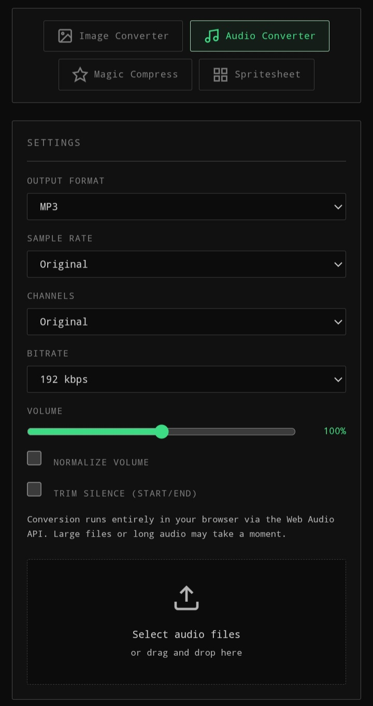
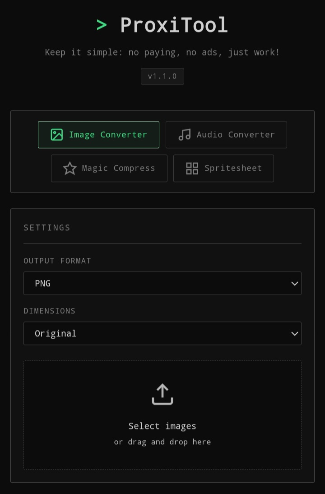
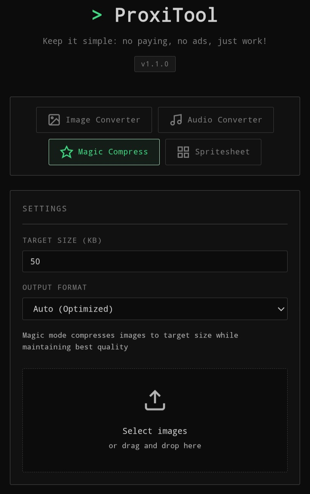
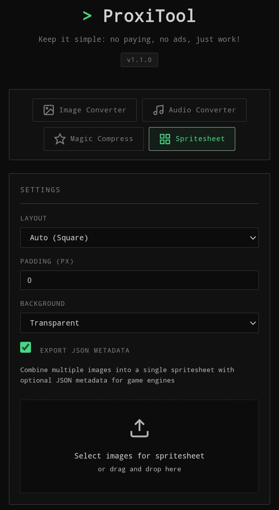

# ProxiTool

A free, open-source tool for converting, resizing, and compressing images with control over quality and file size.

[Open Proxitool](https://catsilly.github.io/ProxiTool/)

## Featured

- **Image Conversion**: Convert images between supported formats.
- **Image Resizing**: Resize images to your desired dimensions.
- **Image Compression**: Reduce file size while preserving visual quality.
- **Audio Conversion**: Convert audio files between supported formats.
- **Spritesheet Generator**: Make spritesheet from your images.
- **Local Processing**: Process your files directly on your device.

## Privacy First
Your files are processed locally and are not uploaded to a remote server.

**No account. No registration. No unnecessary data collection.**

## Why ProxiTool?

Because it:

- Privacy-focused
- 100% Free
- Open source
- No ads
- No premium plan
- No registration
- Simple and powerful

## Support formats

### Image

PNG, JPG (JEPG), Webp, GIF, BMP and more.

### Audio

> [!NOTE]
> Depending on your platform and browser, some formats (such as ogg, etc.) are more complex to handle. 

MP3, WAV and more.

## Preview

> Audio Converter

> Image Converter

> Magic Compress

> Spritesheet Generator

## Open source
ProxiTool is free and open source. Contributions, bug reports, and feature requests are welcome.

## License

MIT
